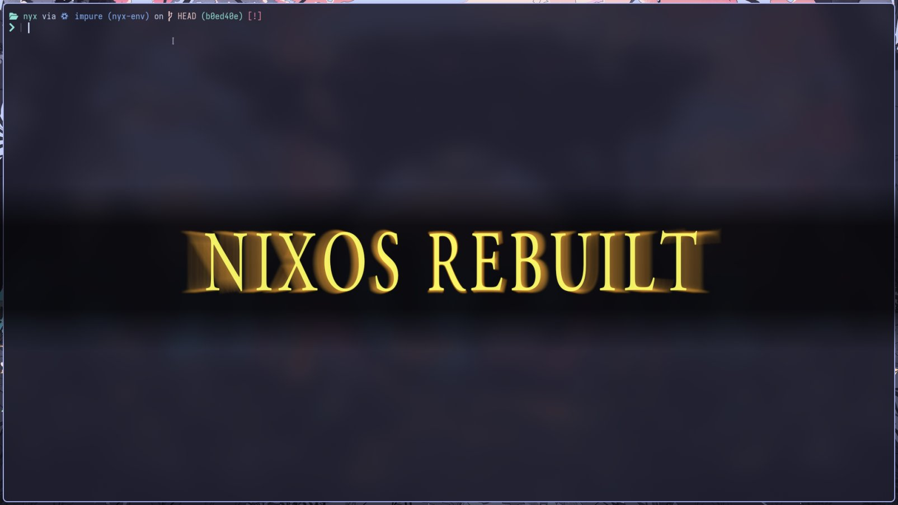

Imagine you want a quick, custom way to display an image as a desktop overlay on
a modern Linux system. On X11 you might easily create a borderless window or use
a panel API.

Under Wayland, though, the rules are different: Wayland's design deliberately
removes many of the windowing assumptions of X (for security and simplicity).
Wayland is a protocol (and library) where the compositor is the display server.
Clients render into GPU buffers (via EGL/OpenGL, for example) and tell the
compositor about new content. Crucially, clients **cannot simply place
themselves anywhere or set stacking order by default**. That makes special
desktop components (panels, notifications, wallpapers) tricky. Or does it?

This small C program that I'm working on, let's call it "popup" for the time
being, is a side project that demonstrates how a not-so-new Wayland extension,
the wlr layer-shell protocol, lets a client display a centered image overlay
without jumping through ugly hoops. It hooks into Wayland's low-level APIs,
loads an image with the popular stb_image library, creates an EGL/OpenGL ES
context, and draws a textured quad. Despite being under 200 lines of code, it
ties together Wayland, wlroots' layer-shell, EGL, GLES2 and stb_image in a neat
proof-of-concept. Below we'll unwrap the story behind these technologies, then
walk through what the code does and why I think it is remarkable.

## Wayland's New Approach to Windows

On classic X11 systems, any app could open a window anywhere on the screen, or
override the window manager to make a topmost overlay. By contrast, Wayland was
designed from the ground up to improve security and performance. The Wayland
protocol defines how a compositor (which is both the display server and window
manager) talks to client applications. In Wayland, the compositor has full
control of input and output: it gets raw keyboard/mouse events and decides which
surface gets them; clients render into GPU buffers and then notify the
compositor about "damage" in those buffers. This removes the kludgy "X server in
the middle" of X11.

However, the default Wayland shell protocol (called XDG Shell) deliberately
forbids apps from choosing their own screen position or z-order. The goal is
security and consistency: no app can spy on or screw with another's window
layout. As Mir developer Sophie 'Sophie-W' Wang explains, _"programs cannot move
their surfaces to a specific location on-screen, or even know where the
compositor has placed them. Programs also have no control over stacking order"_.
This is fine for normal app windows, but desktop components (panels,
backgrounds, notifications, lock screens, etc.) need special privileges.

## Enter the Layer Shell

That's where the wlr layer-shell protocol comes in. Developed for the wlroots
compositor library (used by the Sway window manager, among others), layer-shell
gives clients a sanctioned way to become a "layer" of the desktop. With
layer-shell, an app can request to be anchored to screen edges (top, bottom,
left, right), specify its size, and pick a layer above or below normal apps. In
other words, it can say "I' a panel at the top", or "I'm a wallpaper at the
back", or "I'm a notification at the overlay".

Layer-shell surfaces are still Wayland clients, but they get an exclusive zone
or stacking priority. As the Pengutronix blog on XDC 2018 puts it, this _"allows
clients to specify their position and z-order in relation to the remaining
desktop. Usually the compositor...takes full care of implementing the desktop
user interface, but layer shell allows users to extend and customize their
desktops with additional applications without relying on the existing shell."_
In fact, Sway uses layer-shell for its wallpaper, lock screen, panel, and
notifications. Other compositors like KDE's KWin and Mir also support
layer-shell, but that's not what we're here for today.

In short, layer-shell breaks the old Wayland assumption that clients don't know
anything about the desktop layout. It _is_ an unstable protocol (hence the
include wlr-layer-shell-unstable-v1-client-protocol.h in the code), but it is
also widely adopted in modern Wayland compositors.

```c
#include "wlr-layer-shell-unstable-v1-client-protocol.h"
...
static struct zwlr_layer_shell_v1 *layer_shell;
static struct zwlr_layer_surface_v1 *layer_surface;
```

## How the popup Program Works

I think you had enough of me yapping about Wayland and its protocols, I'm even
willing to bet that most of you don't even _use_ Wayland. Now that I'm done
explaining why things are the way they are, let's talk about my nifty little
program.

### Loading Images

When you run this program with an image as an argument, say, as
`popup picture.png`, what happens under the hood is a careful dance between
several parts of the Linux graphics stack. The first step is loading the image
itself. Instead of pulling in a heavy graphics library, the code uses
`stb_image`, a single-header library that can read formats like PNG and JPEG
straight into raw pixel arrays. With one function call, it gets the width,
height, and RGBA data in memory. This keeps the program lightweight and
dependency-free. I have considered writing my _own_ library, I wanted to get
results before the idea in my head began to fade. Nevertheless, `stb_image` is a
very nice library that I _actually_ enjoyed working with.

```c
#define STB_IMAGE_IMPLEMENTATION
#include "stb_image.h"

int img_w, img_h, img_c;
uint8_t *img_data = stbi_load(argv[1], &img_w, &img_h, &img_c, 4);
if (!img_data)
    fail("image load failed");
```

### Connecting to Wayland

Next comes the Wayland setup. The program connects to the running Wayland
compositor---the central authority that manages windows, inputs, and display.
Through the Wayland registry, it binds to three key interfaces: the compositor
itself (`wl_compositor`), the seat (`wl_seat`) which represents input devices
like keyboard and mouse, and most importantly, the `zwlr_layer_shell_v1`
interface. This last one is what allows the surface we’re about to create to
become a special "layer" surface.

```c
display = wl_display_connect(NULL);
registry = wl_display_get_registry(display);
wl_registry_add_listener(registry, &registry_listener, NULL);
wl_display_roundtrip(display);
```

A Wayland surface is created with `wl_compositor_create_surface`, and then it is
promoted to a layer surface via `zwlr_layer_shell_v1_get_layer_surface`. By
choosing the overlay layer and anchoring all four edges, the program essentially
tells the compositor: _this window should float on top of everything else,
centered_, with the exact size of the image. After committing the surface, it
waits for the compositor to confirm with a configure event. A handshake that
finalizes the window's size and placement.

```c
display = wl_display_connect(NULL);
registry = wl_display_get_registry(display);
wl_registry_add_listener(registry, &registry_listener, NULL);
wl_display_roundtrip(display);
```

> [!TIP]
> By setting the layer to OVERLAY and anchoring all edges, the popup is
> guaranteed to float above everything else, centered, at exactly the size of
> the image.

Once that's settled, the graphics part begins. A `wl_egl_window` is created,
which acts as a bridge between the Wayland surface and EGL, the interface that
manages rendering contexts. Through EGL, the program requests an OpenGL ES 2.0
context and a window surface. This means that from now on, anything drawn with
OpenGL ES will appear directly inside the Wayland layer surface.

```c
struct wl_egl_window *egl_window =
    wl_egl_window_create(surface, img_w, img_h);

EGLDisplay egl_display = eglGetDisplay((EGLNativeDisplayType)display);
eglInitialize(egl_display, NULL, NULL);

EGLint ctxattr[] = { EGL_CONTEXT_CLIENT_VERSION, 2, EGL_NONE };
EGLContext egl_context = eglCreateContext(egl_display, config,
                                          EGL_NO_CONTEXT, ctxattr);
```

The actual rendering is kept deliberately simple. The program compiles two small
GLSL shaders: a vertex shader that passes through positions and texture
coordinates, and a fragment shader that samples from a texture. What this means
is that a pair of shaders pass through vertex coordinates and sample from a 2D
texture:

```c
const char *vert_src =
    "attribute vec2 pos;"
    "attribute vec2 tex;"
    "varying vec2 v_tex;"
    "void main(){gl_Position=vec4(pos,0,1);v_tex=tex;}";

const char *frag_src =
    "precision mediump float;"
    "uniform sampler2D img;"
    "varying vec2 v_tex;"
    "void main(){gl_FragColor=texture2D(img,v_tex);}";
```

It then defines a rectangle (two triangles forming a quad) that covers the
window and maps the image's pixels onto it. The pixel data loaded earlier is
uploaded into a GPU texture with `glTexImage2D`.

```c
const char *vert_src =
    "attribute vec2 pos;"
    "attribute vec2 tex;"
    "varying vec2 v_tex;"
    "void main(){gl_Position=vec4(pos,0,1);v_tex=tex;}";

const char *frag_src =
    "precision mediump float;"
    "uniform sampler2D img;"
    "varying vec2 v_tex;"
    "void main(){gl_FragColor=texture2D(img,v_tex);}";
```

With everything in place, the program clears the background to full
transparency, draws the textured quad, and swaps buffers. At this point, the
compositor receives the buffer and composites it onto the screen. Your image now
floats on top of the desktop, just as intended.

```c
glClearColor(0, 0, 0, 0);
glClear(GL_COLOR_BUFFER_BIT);
glDrawElements(GL_TRIANGLES, 6, GL_UNSIGNED_SHORT, 0);
eglSwapBuffers(egl_display, egl_surface);
```

Finally, the program enters a short-lived event loop. It listens for pointer or
keyboard input from the Wayland seat: a mouse click, or pressing Escape or Q
will close the popup. Even if no input is received, the program has a built-in
timeout of two seconds, after which it exits on its own. Either way, once the
loop ends, the EGL and Wayland objects are destroyed, and the program terminates
cleanly. Great success!

## Closing Thoughts

This was an unusual post to make. I like talking about ideas and maybe what can
be referred to as "tech philosophy" but wanted to spend some talking about how
something _really_ works today. Maybe let me know if you enjoyed this post? I
know I enjoyed writing the program, and talking about Wayland a little. On the
note of the program, let me praise it a little more because I enjoyed writing it
way too much.

What makes this tiny little application remarkable is not its feature set. You
know, it simply shows an image for a brief moment but what it demonstrates about
the modern Linux graphics stack. With no toolkit like GTK or Qt, and no window
manager hacks, it creates a fully accelerated, properly composited overlay
window. It does so by relying directly on Wayland protocols, the layer-shell
extension, and the EGL/OpenGL ES pipeline.

The result is a kind of minimalism that appeals to system tinkerers and embedded
developers alike. In less than two hundred lines of C, you can see the entire
path from raw image data to pixels on the screen, accelerated by the GPU,
integrated seamlessly with the desktop compositor, and respecting the security
boundaries of Wayland.

This is exactly the kind of power that layer-shell was designed to unlock. Under
X11, creating a borderless overlay was trivial but messy; under vanilla Wayland
it was impossible without compositor support. With layer-shell, compositors like
Sway or GNOME’s mutter can allow trusted clients to declare themselves as
panels, wallpapers, or overlays. Sway itself uses this protocol for its own bar,
notifications, and lock screen. Our little popup program is, in effect, using
the same mechanism to become a transient overlay.

It is also worth noticing the efficiency of the rendering path. The image is
uploaded once to the GPU, drawn with a single call, and swapped to the
compositor. There are no extra copies or layers of indirection. As the Wayland
documentation explains, clients render directly into GPU buffers, which the
compositor can then use as textures when compositing the final scene . The code
is a direct embodiment of that principle.

In the end, the marvel is not the popup itself but the clarity of the example.
It shows how the abstractions introduced by Wayland ---strict separation of
roles, client responsibility for rendering, compositor control over placement---
can still be bent to allow rich desktop components. The layer-shell protocol
bridges that gap. And this little image rendereer, tiny as it is, tells the
story of how Linux desktops are evolving: more secure, more composited, but
still flexible enough for creative developers to extend.
