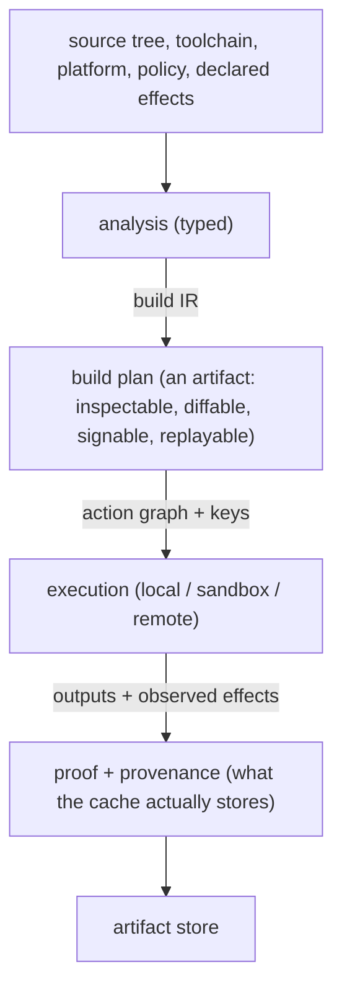
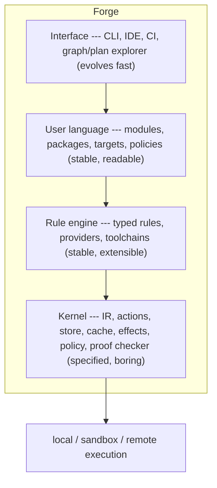

[Circus]: https://github.com/manic-systems/circus/
[Manic Systems]: https://github.com/manic-systems
[feel-co]: https://github.com/feel-co

Hope you've been well. I was on vacation for the past 10~ days or so, which gave
me ample time to work on a few side-projects that I wanted to get out of my way
for the future. One of those projects, which I've worked on full time during my
vacation, was [Circus]---a modern CI system for Nix that'll handle our building
and caching primarily at [Manic Systems] and [feel-co] for our vast repertoire
of Rust projects. I kind of have a love/hate relationship with this project and
perhaps I will cover this project by itself in a different post, but what
matters today for the purposes of this post is that this project, through
torture and joy, taught me there are a fair bit of things _fundamentally wrong_
with Nix. This post, in turn, is an organized dump of my thoughts (both rational
and irrational) about building a build system. I _really doubt_ I will _ever_
try it, no but I'll be damned if I don't talk about it.

> There is prior art for thinking about this rigorously, most notably _Build
> Systems à la Carte_[^bsalc], which decomposes existing build systems along two
> axes: how they schedule work and how they rebuild it. I'll wave at that paper
> periodically. The rest of this post is opinion, not theorem. During the
> writing of this port I was also reminded of the insightful _The postmodern
> build system_[^pmbs] post, which references the same paper all the same. The
> lenses through which we approach the paper is rather different, but it is
> worth mentioning it if you're interested in further reading.

[^bsalc]: Mokhov, Mitchell, Peyton Jones. _Build Systems à la Carte_. ICFP 2018.
    <https://dl.acm.org/doi/10.1145/3236774>. The paper's "rebuilder ×
    scheduler" decomposition is the cleanest formal lens I know of for comparing
    Make, Shake, Bazel, Nix, and friends without religious war.

[^pmbs]: <https://jade.fyi/blog/the-postmodern-build-system>

## You Can Build a Build System

**Yes I can**. That's the post, see you next time.

Okay, the real answer is that _yes_ I (or for this post, _we_) can do it but we
have to honestly describe what a build system is, and avoid beating around the
bush once the idea is reality. This is a challenge about a build system, where
the initial thought you have and the product you inevitably get wildly different
from the concepts [^2] and ultimately you have to either change the scope or
your defined goals.

[^2]: I think this is pretty much what happened with Nix. There was an idea, a
    design that follow, and the eventual "meltdown" (to risk being a little
    dramatic) that isolated the author from his work. When it got adopted
    relatively wide-scale, the author got further isolated and thus joined a
    commercial fork that actively makes the original project work with
    half-baked ideas that don't do the due diligence of verifying basic
    concepts.

A build system is not a command runner. It is not a nicer shell script. It is
not a dependency installer with better cache invalidation. It is not a CI
service. It is not a graph database that happens to call compilers. It is not a
language package manager, though many package managers have slowly backed into
being bad build systems by accident. A build system is a machine for turning
declared intent into artifacts. More precisely, it answers a family of
questions:

1. What do you want built?
2. What does that thing depend on?
3. What transformations are allowed?
4. Which inputs are real?
5. Which inputs are accidental?
6. Where may the work run?
7. What can be reused?
8. What must be rebuilt?
9. What evidence proves that the output corresponds to the inputs?
10. What should the user be told when reality disagrees with the declaration?

That last question is not decoration. Explanation is part of the job. A build
system that cannot explain itself is not merely unfriendly. It is incomplete. It
may still be fast. It may still be popular. It _may even be correct in many
cases_ but the moment something subtle breaks, the user is thrown back into
superstition: delete the cache, run it again, clean the tree, reboot CI, add a
dependency edge until the graph stops screaming. You could call this a form of
indeterminism. Welcome to computing, it's not deterministic. [^1]

[^1]: More precisely, they are not "perfectly deterministic." They are not
    perfectly deterministic (even though many computational models treat them as
    deterministic abstractions) because a real computer is an electronic
    physical system coupled to an environment. Its future state is not fixed
    solely by its program and current architectural state, because it can
    receive genuinely unpredictable physical inputs, such as hardware entropy,
    timing variation, electrical noise, thermal noise, radiation-induced bit
    flips, device faults, and asynchronous external interrupts.

I've elected to use a phrase as absurd as "build a build system that builds
builds" because it points at an abstraction that I find missing in common build
systems; a mature build system should not treat the build as an event. It should
treat the build as an artifact. The build plan should be something you can
inspect, diff, cache, sign, replay, audit, and verify. The artifact should not
merely be the binary or package at the end. The plan itself should be an
artifact. The provenance should be an artifact. The dependency closure should be
an artifact. The proof that the cache hit was valid should be an artifact. The
explanation of why a target rebuilt should be derived from artifacts, not from a
hasty reconstruction of logs after the fact. There should be _so many_ artifacts
that 200 years after your build system dies, they should dig it up and declare
it a burial site. Let me put it this way: a build is not a moment in time. You
can consider it closer to a structured claim about causality. The file changed,
therefore this action changed. The toolchain changed, therefore this output
changed. The platform changed, therefore the old artifact is no longer valid.
The source did not change, the toolchain did not change, the effects did not
change, and the policy still accepts the cache result, therefore this output may
be reused. This should be the object for a build system, rest can be interface.

To make that concrete, here is the chain a build system has to defend:



Each edge is a place a sloppy system loses information. Each node is a place a
serious one keeps it.

## BOBS: Bane of Build Systems

Most build systems are tolerable because most builds are not under pressure most
of the time. This might sound a little bit insulting, but I do not mean it as
such. It is usually just a condition of software. Many projects are small
enough, homogeneous enough, or socially forgiving enough that a loose build
model works. A Makefile can be fine. A shell script can be fine. A
language-native package manager can be fine. A pile of CI YAML can be fine in
the same way that a plank over a ditch can be (considered) a bridge. _Then
arrives scale_. Or regulation. Or cross-compilation. Remote execution. Supply
chain inspection. A second language. Generated code. Release systems that must
be reproduced. A developer on a different operating system. Security incident.
Or most simply a situation or/and an incident where someone asks, with a
straight face, "what exactly went into this binary?"

At that point many "systems", and I call those systems very generously, reveal
that they were never models of build, but mere choreographies. Sure, they knew
which commands were meant to be executed but they had absolutely no idea what
those commands even mean or what they try to convey. To nobody's surprise, this
is a decisive distinction. A command runner says:

```plaintext
run cc -o server server.c
```

A build system says:

```plaintext
produce an ELF executable called server from these declared source files,
using this compiler toolchain, for this target platform, with these flags,
under these effect permissions, producing this declared output type,
with this cache key, this provenance record, and this policy context.
```

The first form is admittedly convenient, and the second form is expensive.
Though, the second form is _also_ the only one that survives contact with
serious infrastructure. [^3]

[^3]: If your reply to this is "_but X works for me_" you can stop reading here,
    because there is nothing we may discuss further. Yes it works, no it's not
    _good_. Those are strictly separate.

The industry repeatedly tries to get the second result from the first
declaration. Consequently: pain.

Tools infer inputs by watching filesystem reads, scrape compiler depfiles, hash
directories, discover tools on PATH, trust lockfiles. Maybe even let environment
variables and system clock leak into builds. Hell, allow network access during
builds. All of those could be fine, but you should not be surprised when results
drift. There are good reasons for some of these compromises. Build tools live in
the real world. The mistake is not compromise, no. The mistake is hiding the
compromise from the model. A _serious_ build system should not pretend all
builds are pure functions. It should model impurity explicitly:

1. A build that reads from the network is not necessarily wrong; a build that
   reads from the network without declaring that fact is wrong.

2. A build that uses `/usr/bin/tar` is not necessarily wrong; a build that
   silently depends on the host's `/usr/bin/tar` and then claims to be
   reproducible is wrong.

3. A build that embeds the current timestamp may be legitimate for a nightly
   development artifact.

4. A build that embeds the current timestamp into a release artifact and then
   advertises reproducibility is lying.

This is where the system must be blunt. Not rude. Blunt. A build system should
not flatter the user's accidental state or hold their hand while they cluelessly
run commands to destroy their system. It should, instead, account for the
possibilities.

## What a Build System Really Is

A build system has five essential responsibilities.

1. It must model work.
2. It must model dependency.
3. It must model change.
4. It must model execution.
5. It must model explanation.

Work is the obvious part. Compile this file. Link these objects. Generate this
parser. Run this test. Package this directory. Build this image. Sign this
artifact. Publish this release. Yada yada, you get the point.

Dependency is a little harder. You might think dependencies are obvious because
they imagine a little graph with arrows (or a hamburger if they're American) but
_real_ dependency is not that clean. A C file depends on headers, compiler
flags, the compiler binary, the linker, the sysroot, the target ABI, generated
files, environment variables if permitted, and sometimes filesystem layout. A
Python wheel may depend on interpreter ABI, platform tags, build backend
behavior, index contents, and native libraries. A container image may depend on
base image identity, file ownership, tar ordering, timestamps, and entrypoint
semantics. _Change is harder still_. A build system must know what changed in a
way that matters. Not all textual changes are semantic changes. Not all semantic
changes are visible from the source tree. A compiler upgrade may change output
without any source change. A policy change may invalidate a release without
changing a byte of source. A cache trust rule may force rebuilding an artifact
that is otherwise identical. A platform constraint may select a different
toolchain.

Ultimately execution is where the model meets dirt. Builds run on machines.
Machines have kernels, filesystems, clocks, CPU features, users, permissions,
environment variables, network interfaces, and broken assumptions. You can
isolate some of this. You can declare some of it. You can forbid some of it,
but, unfortunately you cannot wish it away. Explanation is the part most systems
treat as a luxury. It is not. The user needs to know why the system behaved as
it did. Why did this rebuild? Why did this not rebuild? Why did the cache miss?
Why did the remote cache hit get rejected? Why did the toolchain change? Why is
this target non-hermetic? Why did a test pass locally and fail remotely? Why
does this dependency appear in the closure? Why is this action on the critical
path? A system that cannot answer those questions is making the user debug the
model from side effects.

That is perverse. The build system already has the information or should have
had it. Making the user reconstruct it from logs is just bad design wearing a
Unix beard.

## Existing Systems; Their Teachings

A new build system should not be born from ignorance. Nix, Bazel, and Buck2 each
contain serious ideas. Dismissing them is a good way to build something worse.

### Nix

Nix[^nix] gets something fundamental right: build outputs belong in a store, and
build recipes can be treated as values.

[^nix]: Eelco Dolstra. _The Purely Functional Software Deployment Model_. PhD
    thesis, Utrecht University, 2006.
    <https://edolstra.github.io/pubs/phd-thesis.pdf>. Still the clearest
    explanation of why content-addressed stores and pure derivations matter,
    independent of any opinion about flakes. The store model is powerful because
    it breaks the causal connection between "where I happened to build
    something" and "what the artifact is." It makes dependency closures
    inspectable. It enables substitution. It gives system composition a more
    solid basis than "install some packages and hope no global state leaks." Nix
    also understands, more deeply than many tools, that environments are
    artifacts. A development shell, a package, a system closure, and a
    dependency graph are not separate species. They are related ways of
    describing materialized computation. _The cost_ is that Nix exposes too much
    of its historical machinery to the user. The store is elegant. The language
    and ecosystem are often not. The user must learn derivations, attributes,
    overlays, fixed-output derivations, flakes, modules, package sets,
    evaluation, realization, purity modes, and a large amount of oral tradition.
    A defender can explain every piece. That is not the same as the pieces
    composing into a legible whole.

> Contrary to popular belief, Nix is not difficult simply because its users are
> stupid. It appears difficult because the abstraction boundary is uneven. The
> system gives you real power, but it asks you to internalize too many of its
> organs.

### Bazel

Bazel[^bazel] gets another thing right: the build should be an analyzable action
graph.

[^bazel]: Bazel descends from Google's internal Blaze. The cleanest public
    description of the model is Esfahani et al., _CloudBuild: Microsoft's
    Distributed and Caching Build Service_ (ICSE 2016,
    <https://dl.acm.org/doi/10.1145/2889160.2889222>), which formalizes the same
    "actions are the unit of caching, not commands" idea. The Bazel docs at
    <https://bazel.build/extending/concepts> cover providers, configured
    targets, and transitions. Targets are not just commands. Rules expand into
    actions. Actions have inputs and outputs. Caching and remote execution are
    part of the architecture, not decorations. This is why Bazel works well in
    large monorepos. It knows that scale is not mainly about running commands
    quickly. It is about avoiding work correctly.

Bazel also understands that language-specific build logic belongs in rules, not
in ad hoc local scripts. This is correct. If every team writes its own Java
build, C++ build, Python build, Docker build, and code generation build, the
repository becomes a junkyard of half-models.

The cost is institutional weight. Bazel is often excellent when an organization
can afford to become a Bazel organization. It wants structure. It wants rule
ownership. It wants platform discipline. It wants people who know why providers
matter. It wants remote cache infrastructure. It wants conventions. It rewards a
certain kind of central authority.

That is not inherently bad. Large organizations need authority. But Bazel can
feel like using civil engineering equipment to repair a garden path. Sometimes
the right answer really is "use the excavator." Sometimes it is not.

### Buck2

Buck2 is interesting because... it sounds like "fuck too". Ha, no.

It is interesting[^buck2] because it learns from large graph build systems and
cares aggressively about performance and developer iteration.

[^buck2]: Meta's open-source announcement is the practical reference:
    <https://engineering.fb.com/2023/04/06/open-source/buck2-open-source-large-scale-build-system/>.
    The "incremental graph computation engine" (DICE) and Starlark-as-extension
    are the two ideas worth stealing without further argument. Its use of
    Starlark is pragmatic. A deterministic, restricted, Python-like language is
    a reasonable extension mechanism. Buck2 also reflects a useful attitude:
    graph construction speed matters. Not theoretically. Humanly. A build system
    that makes every edit feel like waking a bureaucracy will train users to
    bypass it. The limitation, however, is that speed and extension discipline
    do not by themselves solve the deeper semantic problem. The rule author
    still inhabits a different conceptual world from the ordinary user.
    Providers, actions, transitions, attributes, configurations, and toolchains
    are necessary concepts, but when they leak badly the user is left
    manipulating a machine they cannot predict.

### What We Can Learn

Obviously none of those systems is inherently foolish. Each system is a real
answer to a real pressure, but none of them are the final answer. A better
system should frankly _steal_ from all of them. To hell with collaborating,
leave it all behind.

- From Nix, we're taking content-addressed stores, derivation-like build
  descriptions, dependency closures, and the idea that environments are build
  artifacts.

- From Bazel, we're taking explicit action graphs, rule abstraction, remote
  execution, disciplined caching, and queryability.

- From Buck2, we're taking fast incremental analysis, deterministic extension,
  and respect for the developer loop.

Then it should add what the existing family does not unify cleanly: typed
effects, proof-carrying build plans, capability-scoped impurity, stable semantic
IR, progressive hermeticity, and explanations good enough that users stop
treating the build graph as weather.

To make the borrowing concrete, here is the same set of concerns across the
three systems and what a serious successor would have to do differently:

<!--markdownlint-disable MD013-->

| Concern               | Nix                                        | Bazel                                | Buck2                                | What a successor must add                                |
| --------------------- | ------------------------------------------ | ------------------------------------ | ------------------------------------ | -------------------------------------------------------- |
| Action identity       | derivation hash (input-addressed)          | action key over inputs + command     | action key + DICE graph              | key includes policy, effects, output contract, rule ver. |
| Effects / impurity    | binary: pure or fixed-output               | mostly forbidden; sandbox by default | mostly forbidden; sandbox by default | typed capability set, declared and scoped per action     |
| Hermeticity           | binary claim                               | binary claim                         | binary claim                         | a ratchet (H0–H5), enforceable by policy                 |
| Cache trust           | binary signature on store paths            | per-instance config                  | per-instance config                  | signed proof record returned alongside bytes             |
| Build plan as object  | derivation graph (yes, but opaque to user) | analysis cache (internal)            | DICE state (internal)                | first-class artifact: diffable, signable, executable     |
| Cross-language story  | strong, via derivations                    | strong, via rules                    | strong, via rules                    | same, plus typed importers with confidence labels        |
| Surface <-> semantics | leaks heavily (flakes, overlays, attrs)    | rules ≈ semantics; Starlark surface  | rules ≈ semantics; Starlark surface  | surface lowers into a versioned IR; IR is the contract   |
| Migration story       | rewrite or wrap                            | rewrite or `genrule`                 | rewrite or `genrule`                 | importers + foreign targets + hermeticity ratchet        |
| Explanation           | weak (`why-depends`, eval traces)          | medium (`aquery`, `cquery`)          | medium (`buck2 audit`, `buck2 log`)  | first-class: `why-rebuilt`, `why-cached`, plan diff      |

<!--markdownlint-enable MD013-->

The point is not "Forge wins every column.", because it doesn't. The point is
that no existing system fills every column today, so the design space is real.

## Future-proofing (It Ain't Plugins)

Now that we've established what we _already_ have in store (pun fully intended),
let's discuss futureproofing. We have to think about future-proofing, because we
want this tool to be the answer to our problems. It should not be a part of any
PhD thesis, and it should not be a temporary, band-aid solution to an
overarching problem that will stall us for years until the cycle starts again.

When a project calls itself "future-proof," it usually means "has plugins." I
know this, because I've seen it happen time and time again. I'm also responsible
for it myself. This is lazy. This is also too weak.

Simply put, a plugin system is not future-proofing; a plugin system can be where
semantics go to die. If the core model is vague, plugins become untyped
exceptions to everything. They begin as flexibility and end as sediment. Ten
years later, the system cannot move because too many local tricks depend on
unspecified behavior.

**Future-proofing requires a small semantic kernel**.

The kernel should understand artifacts, actions, dependencies, platforms,
toolchains, effects, policies, caches, plans, and proofs. It should not
understand Rust crates, Java jars, Python wheels, Go modules, C headers, npm
packages, OCI layers, LaTeX documents, FPGA bitstreams, firmware bundles, or
whatever the next ecosystem invents after deciding all previous tools were
spiritually impure. Language support belongs above the kernel. The kernel should
be boring. And I mean "boring" in a somewhat positive light, because it is _the_
condition of survival. Boring is the condition of survival. Filesystems are
boring until they are not. Compilers are boring until they disagree. Linkers are
boring until a flag changes the ABI. The build kernel should be the part least
eager to impress anyone.

The system also needs a stable intermediate representation. Surface syntax will
change. User taste will change. Language ecosystems will change. Execution
backends will change. But the build IR should be versioned, specified, and
conservative. Users may write friendly declarations. Rule authors may write
typed rule code. Importers may generate build files from Cargo, CMake, Gradle,
npm, or Nix. All of it should lower into a **canonical IR**.

"IR" might sound a little odd to you, but let me elaborate.

In our ideal (and entirely imaginary build system) that IR is the contract; if
the surface language changes, the IR remains analyzable. Or if the executor
changes, the IR remains executable. When a new language ecosystem appears, it
targets the IR instead of punching holes through the system.

This is the same broad lesson as many durable systems: separate interface from
representation, and representation from execution. SQL is not the storage
engine. LLVM IR is not C. A PDF is not the program that produced it. The point
is not that those examples are perfect. The point is that durable systems
usually find a middle form that can outlive frontends and backends.

A build system needs that middle form.

## The Proposed System

This is not an actual proposal, of course. Not in the sense that this post is a
_formal_ writeup. It's a hypothetical (and a romanticized) build system I'm
establishing for the purposes of this writeup and to establish... ground rules
let's say. Let's call this hypothetical system... Forge. The name is not
important, but it is short enough to type.

Forge has four layers:

1. The kernel owns the build IR, action execution contract, artifact store,
   cache protocol, effect model, policy model, provenance record format, and
   proof checker.

2. The rule engine lets experts define reusable abstractions for languages,
   platforms, packaging formats, test frameworks, code generators, and
   deployment targets.

3. The user language gives ordinary developers a direct way to describe
   packages, targets, dependencies, toolchains, tests, images, and releases.

4. The interface provides the CLI, editor integration, CI integration, graph
   explorer, cache debugger, provenance viewer, and migration tools.

The main reason for this split, which I find to be a decently maintainable
model, is that a common failure in build systems is allowing the user-facing
syntax to become the semantic model. Once that happens, every syntactic
convenience either becomes a permanent semantic wart or breaks users when
removed. Therefore, the system should not be trapped by its first frontend.

I envision the structure as something like this:



Each layer below talks to the layer above only through a typed boundary. Surface
syntax never reaches the kernel; the rule engine never sees raw user text; the
executor never sees rules, only actions.

<!--markdownlint-disable MD013-->

| Layer         | Audience                                 | Stability requirement  | Main output                         |
| ------------- | ---------------------------------------- | ---------------------- | ----------------------------------- |
| Kernel        | implementers, auditors, remote executors | extremely stable       | typed build IR, artifacts, proofs   |
| Rule engine   | toolchain and ecosystem maintainers      | stable, but extensible | reusable build rules                |
| User language | developers, packagers                    | stable and readable    | project declarations                |
| Interface     | everyone                                 | can evolve quickly     | diagnostics, commands, visual tools |

<!--markdownlint-enable MD013-->

The kernel should be small enough that it can be specified. The rule engine
should be powerful enough that users rarely need to think about the kernel. The
user language should be simple enough that a project file can be read during
code review without summoning a specialist. The interface should assume that the
user is busy, not stupid.

## Kernel objects

In theory (we can argue whether this holds under scrutiny) Forge's tiny kernel
needs only a handful of primitive concepts. First concept is that _an artifact
is content + metadata_. It may be a file, directory tree, archive, binary,
package, image, log, test report, generated source tree, build plan, provenance
record, or proof. It has a digest. It has a type. It has declared equivalence
rules. It has provenance. Consequently, _an action is a transformation from
inputs to outputs_. It has declared inputs, output contracts, arguments,
environment, platform constraints, resource requirements, effect capabilities,
and toolchain references.

Then, the targets. _A target is a name promise_. It is simply the thing a user
asks for. A target resolves through rules into configured targets, providers,
actions, and artifacts. What are providers? They are _typed information_ passed
between rules. E.g., this target provides C headers, this target provides a Rust
library, this target provides a binary, this target provides an OCI layer, this
target provides runtime files, this target provides generated sources.

Platforms and toolchains are a little different. They're more so about the
constraints and semantic boundaries that we have to care about. For example, _a
platform is a set of constraints about where something runs or what something
targets_. Operating system, architecture, ABI, libc, kernel features, CPU
features, GPU availability, sandbox type, remote execution pool, and target
triple can all be platform facts. A toolchain, however, _is a typed bundle of
tools and semantics_. It is _not_ "whatever gcc happens to be on `PATH`". A C
toolchain includes compiler, linker, assembler, sysroot, standard library,
target triple, default flags, feature support, and compatibility claims. A
Python toolchain includes interpreter, ABI, packaging behavior, platform tags,
and native extension policy. A Rust toolchain includes compiler,
cargo-compatible metadata if needed, standard library, target support, and
feature behavior.

As a tiny little addition to existing models, I've decided to think about
_effects_[^effects].

[^effects]: There has been prior work on bringing effect typing into Nix
    specifically; see, e.g., the experimental sketch at
    <https://github.com/kleisli-io/nix-effects>. The point here is not to adopt
    that exact design but to take seriously that impurity is structured, not a
    binary label. As I've mentioned earlier, a good build system should not ban
    impurity outright; it should make it explicit. We could argue whether
    impurity has a place in our perfect little build system but we also have to
    admit that there is no such thing as a "perfect build system", and to be a
    _good_ build system we should care about correctness for all possible use
    cases instead of just sticking to the happy path. Thus, _an effect is
    controlled impurity_. This has been explored in the Nix space recently, and
    I find it rather interesting, but in the perfect build system this should be
    a first-class citizen. With the effects system, filesystem reads outside
    declared inputs. Network access. Environment variables. Clock reads.
    Randomness. Host tool discovery. Process spawning. Device access. User
    identity. Secrets. Effects are not all banned. They are declared, scoped,
    cached according to **policy**, and reported. The build system is _fully_
    aware of what is happening, and it can decide _exactly_ what to do with
    impurity. The policy system, which makes this possible (in theory) is _a
    ruleset about what is allowed_. Release builds may forbid network access. CI
    may accept cache hits only from signed builders. A package may forbid GPL
    dependencies. A test may access a fake service but not the public internet.
    A target may require reproducibility across two independent builders. A
    developer build may allow local host tools while release builds may not.
    This is technically done in Nix through very roundabout ways that are
    extremely limiting, and often not too performant.

Lastly, the proof. A proof is evidence. A sandbox trace. A content hash. A
signature. A reproducibility comparison. A type-check result. A dependency
closure validation. A policy check. A cache acceptance record. A rule
conformance result.

That is enough. The kernel does not need to know whether a thing is fashionable.
It needs to know whether the action and artifact model is sound.

## Effects

Build systems often speak as if impurity were an unfortunate edge case. It is
not. It is everywhere. See the many examples in an average build
system/compiler/etc.

A configure script probes the host.

A compiler reads default specs.

A linker searches system paths.

A package manager consults an index.

A code generator embeds a timestamp.

A test reads the locale.

A script discovers `python` on PATH.

A build uses `git rev-parse HEAD`.

A documentation generator fetches remote schemas.

A container build copies file ownership from the host.

A release action signs an artifact with a secret.

Ughhhhh. The question is not whether impurity exists. It does. The question is
whether the build model has a place to put it. Forge should have a capability
model for effects. E.g., a build action may say:

```plaintext
effects = []
```

That means no network, no host filesystem outside declared inputs, no undeclared
environment variables, no clock, no randomness, no host tool discovery.

Another action may say:

```plaintext
effects = [
  env("TZ", value = "UTC")
]
```

Another:

```plaintext
effects = [
  host_tool("git"),
  host_path(".git", mode = "read")
]
```

Another:

```plaintext
effects = [
  network("crates.io", mode = "fetch", fixed_outputs = true)
]
```

Another:

```plaintext
effects = [
  secret("release-signing-key")
]
```

These are different kinds of impurity. Treating them as the same vague "not
hermetic" status is lazy, and become roadblocks when you want to build something
that is not 100%-hermetic-satisfaction-guaranteed. For example, a build that
reads `.git` to produce a development version file is acceptable if marked
local-only. Similarly, a build that reads `.git` during a release may be
acceptable if the commit is part of the declared source identity; Nixpkgs makes
use of those systems regularly.

A build that fetches a pinned dependency by checksum is not the same as a build
that runs arbitrary network calls during compilation. Alternatively, a build
that uses a secret to authenticate a fixed-output fetch is not the same as a
build that lets a compiler see a signing key. The differences are not quite
subtle, but they are often times bluntly cast aside for a happy path that we
guarantee only after all the time and energy for bruteforcing. Instead, the
capability model should allow precision and thus wider adoption. _This is one
place where Forge should be more annoying than current tools_. If an action
tries to read an undeclared path, it should fail. If policy allows learning
mode, it may produce a suggested declaration. But it should not silently succeed
and corrupt the cache key.

Consider this example:

```plaintext
Action //tools:generate_version read undeclared path .git/HEAD.

The action currently declares no host path effects.

Possible fixes:
1. declare host_path(".git", mode = "read") and mark the action local-only
2. pass the commit hash as a declared input
3. remove Git metadata from the generated output
```

That is a useful error. It teaches the model while fixing the build. You could
even make "possible fixes" a part of the interface so that you don't have to go
back to the "oh the error messages such" meme.

## Hermeticity As a Ratchet

Hermeticity is often preached badly. People talk as if the only respectable
build is perfectly hermetic and everyone else is an animal. Well, I often share
this view of first-class vs lower-class build states but this is not a proper
migration strategy. It is a way to be correct in an empty room, or maybe a way
to empty the room so you can speak alone.

Learning from those mistakes, Forge should treat hermeticity as a ratchet. A
build can start weak and become stronger over time. The system should
distinguish levels clearly.

<!--markdownlint-disable MD013-->

| Level | Meaning                                                | Typical use                      |
| ----- | ------------------------------------------------------ | -------------------------------- |
| H0    | Untracked shell execution                              | quick wrapping, legacy discovery |
| H1    | Declared outputs, weak or inferred inputs              | early migration                  |
| H2    | Declared inputs and outputs, sandboxed local execution | normal development               |
| H3    | Declared toolchains and effects, remote-cache safe     | CI                               |
| H4    | Reproduced and policy-clean with signed provenance     | release                          |
| H5    | Independently reproduced, audited, long-term archival  | critical supply-chain artifacts  |

<!--markdownlint-enable MD013-->

While this system is rather... complex and possibly a bit annoying to work with,
it is meaningful for the _average_ user because slapping the labels "hermetic"
and "not hermetic" on something is way too coarse. A project migrating from
CMake or shell scripts may reasonably begin at H1. A release artifact should not
remain there. They already weren't hermetic, so what's the harm?

The system should say:

```plaintext
Built //app:server at H2.

Not H3 because:
- uses host tool /usr/bin/protoc
- reads environment variable LANG
- toolchain identity is not pinned

Upgrade path:
- replace host protoc with toolchain protobuf.protoc
- declare LANG or force locale to C.UTF-8
- pin cc_toolchain linux-x86_64-gcc-14
```

Again, while this is slightly more complex, this is strictly better than purity
sermons and better than silence. The ratchet should be enforceable by policy:

```plaintext
policy ci {
  require hermeticity >= H3
}

policy release {
  require hermeticity >= H4
  forbid effect.network
  require provenance.signed
  require reproducible.builders >= 2
}
```

This gives projects room to breathe without letting weak builds masquerade as
strong ones.

## Cache Correctness, Or; Making It Usable

Caching is where build systems become either useful, or dangerous. A cache makes
correct systems fast. A cache makes incorrect systems look correct until the
wrong artifact appears at the wrong time. A _good cache_ makes a system usable.
No, really. Listen to most complaints about Rust. When you go through the
surface-level criticism about types and strictness you go back to the beginner
joke of "fighting the compiler" in a different way: _builds are slow_.

Thus we should care about caching. A target-name cache is garbage. A timestamp
cache is barely a cache. A directory hash cache is often too coarse. A cache key
must represent the semantic action.

A Forge action key should include:

<!--markdownlint-disable MD013-->

| Component                     | Included because                                  |
| ----------------------------- | ------------------------------------------------- |
| Action schema                 | rule behavior is important                        |
| Command or evaluator identity | different executors may produce different outputs |
| Declared input digests        | source and generated inputs are important         |
| Toolchain identity            | compilers and linkers are inputs                  |
| Platform constraints          | target and execution context are important        |
| Declared environment          | environment affects output                        |
| Declared effects              | impurity changes trust and reuse                  |
| Policy context                | different policies may accept different outputs   |
| Output contract               | expected output semantics are important           |
| Rule version                  | abstraction semantics change over time            |

<!--markdownlint-enable MD013-->

Concretely, the key is a structured digest, not a string-concat. Something along
these lines:

```plaintext
action_key(a) = H(
  schema:      H(a.rule.schema_version),
  evaluator:   H(a.rule.id, a.rule.version),
  inputs:      merkle({ name -> H(content) for name, content in a.inputs }),
  toolchain:   H(a.toolchain.id, a.toolchain.digest),
  platform:    H(canonical(a.platform.constraints)),
  env:         H(canonical(a.declared_env)),
  effects:     H(canonical(a.declared_effects)),
  policy_ctx:  H(a.policy.id, a.policy.version),
  output:      H(canonical(a.output_contract)),
)
```

Two properties matter and are usually skipped. First, `canonical(...)` must be a
stable serialization (sorted keys, fixed encoding) or the key drifts with
incidental ordering. Second, `policy_ctx` belongs in the key: a release-policy
acceptance and a dev-policy acceptance are not the same cache entry even if the
bytes match, because they carry different trust claims. This is the failure mode
that lets unsigned dev builds masquerade as release artifacts when caches are
shared.

While working on [ncro](https://github.com/feel-co/ncro) as a Nix cache proxy
(which _wildly_ improves cache behaviour with rotation and path filters) and our
CI [Circus](https://github.com/manic-systems/circus/) something that occurred to
me is that Nix caches communicate very little with their consumers.

In the case of Forge, a cache hit should return more than bytes. It should
return a proof record. Assume you've invoked:

```bash
# Query a cache's information endpoint directly
$ forge why-cache //app:server
```

The cache would return a bunch of details about your artifact. Potentially
something like this:

```plaintext
target: //app:server
configuration: mode=debug, target=linux-x86_64
cache status: remote hit
accepted by policy: dev-default

action key: sha256:...
builder: remote-linux-42
toolchain: rust 1.84.0, digest sha256:...
inputs: 231 artifacts
declared effects: none
observed effects: none
output contract: executable + runtime closure
signature: valid
```

Or for rejected hits:

```plaintext
target: //release:server
cache status: remote hit rejected

reason:
- cache entry was produced by unsigned builder local-dev
- release policy accepts only builders in group ci-release
- artifact was not reproduced by an independent builder

next:
- rebuild under release policy
- or change policy release.cache.trust if this is intentional
```

This is how a cache becomes part of the system's reasoning instead of an oracle.
Consequently the interface should be able to allow cache policies natively, with
fallback, without hindering user experience in the name of correctness.

## Output Equivalence

People often equate reproducibility with bit-for-bit identity. That is the
cleanest case, and release systems should aim for it when possible. But the real
world has artifacts where byte identity is not always the right equivalence
relation. E.g., debug paths may differ while executable code is identical. Or
archive member ordering may vary unless normalized. Signatures necessarily
differ if produced at different times or by different keys. Generated
documentation may include timestamps. Container layers may encode ownership or
ordering details. Thus, I would argue that a serious system should not use "not
bit-identical" as the only possible result. It should support declared output
equivalence. For example:

```plaintext
contract = {
  deterministic = true
  equivalence = byte_identical
}
```

A bit more fine-grained:

```plaintext
contract = {
  deterministic = true
  equivalence = elf_equivalent {
    ignore_sections = [".comment", ".note.build_id"]
    require_text_equal = true
    require_dynamic_symbols_equal = true
  }
}
```

or

```plaintext
contract = {
  deterministic = false
  equivalence = signed_payload {
    payload_must_match = true
    signature_may_differ = true
  }
}
```

This is dangerous if abused. The system should make weakened equivalence
visible. It should not let people casually declare that outputs are "basically
the same" because a test passed once. But the concept is needed. Otherwise the
system can only speak in one bit: identical or not identical. Engineering needs
more vocabulary than that.

## Build Plan As A First-class Artifact

Perhaps the _most critical_ object in Forge (the rest being no less important)
is the build plan. What is a build plan? Simply put, it is the _fully resolved,
configured, policy-checked description of what will happen_. It contains fields
such as, but not limited to, targets, configurations, selected toolchains,
action graph, action keys, expected outputs, effect permissions, policy
decisions, and proof obligations. Most critically:

1. It should be serializable.
2. It should be content-addressed.
3. It should be diffable.
4. It should be executable without redoing analysis.
5. It should be reviewable in CI.
6. It should be signable.
7. It should be reproducible as an object.

The interface, as discussed earlier, is less important but you could imagine a
command-line interface like so:

```bash
# Various commands to interact with a build plan
$ forge plan //release:server -o server.plan
$ forge diff-plan old.plan new.plan
$ forge verify-plan server.plan
$ forge execute server.plan
```

In the hypothetical interface, a plan diff might display:

```plaintext
Changed:
- rust toolchain 1.83.0 -> 1.84.0
- dependency serde 1.0.210 -> 1.0.215
- release policy now requires **2** independent reproductions
- **184** action keys changed

Unchanged:
- target platform linux-x86_64
- OCI base image digest
- license allowlist
- signing policy
```

This is ultimately better than reviewing a CI log. Logs are aftermath; plans are
intent. A release process should approve a plan, not merely a commit. The commit
is source identity, the plan is build identity. They are related, but not the
same. Is this distinction pedantic? Yes, but only until you need it. Then it
becomes obvious.

## Lingua Usoris

Your build system's _lingua franca_ should be boring. The _user language_ should
be boring. This is not because users cannot handle power. It is because build
files are read more often than they are written, and clever build files age
badly. A small project should look like this:

```plaintext
module example.app
version "0.1.0"

use forge.rust as rust
use forge.oci as oci

platform linux_x64 {
  os = "linux"
  arch = "x86_64"
  libc = "glibc"
}

toolchain rust_stable = rust.toolchain {
  version = "1.84.0"
  targets = [linux_x64]
}

package core = rust.library {
  sources = glob("src/core/**/*.rs")
  edition = "2021"
  toolchain = rust_stable
}

package server = rust.binary {
  main = "src/server/main.rs"
  deps = [core]
  toolchain = rust_stable
}

test server_tests = rust.test {
  sources = glob("tests/**/*.rs")
  deps = [core, server]
  effects = [
    env("TZ", value = "UTC")
  ]
}

image server_image = oci.image {
  entrypoint = server
  base = oci.scratch
  files = {
    "/app/server" = server.binary
  }
}

release server_release = bundle {
  artifacts = [server_image]
  policy = policies.release
}
```

The important feature here is not syntax. It is that the nouns correspond to
real build concepts. Module. Platform. Toolchain. Package. Test. Image. Release.
Policy. A release policy might look like this:

```plaintext
policy release {
  require hermeticity >= H4
  forbid effect.network
  forbid effect.host_path
  require provenance.signed_by in ["ci-release"]
  require cache.trust in ["remote-ci-verified"]
  require reproducible.builders >= 2

  license {
    allow = ["MIT", "Apache-2.0", "BSD-2-Clause", "BSD-3-Clause"]
    deny = ["GPL-3.0"]
  }
}
```

A deliberately weak legacy target should look weak:

```plaintext
foreign legacy_bundle = shell.action {
  command = ["./build.sh"]

  outputs = {
    archive = "dist/server.tar.gz"
  }

  effects = [
    host_path(".", mode = "read"),
    host_tool("bash"),
    host_tool("tar"),
    env("PATH")
  ]

  hermeticity = H1
  cache = "local-only"
}
```

This should not be forbidden. It should also not be allowed to pass as a clean
release build.

The system should say:

```plaintext
Built //legacy:legacy_bundle at H1.

This target cannot enter //release:server_release because release policy requires:
- H4 or above
```

That is the right kind of friction, or as I would like to call it, investment.

## Rule Authoring

The ordinary user should not write rule internals often. Rule authors should.

A rule is a typed function from attributes and providers to actions and
providers. It does not perform build work during analysis. It describes build
work. Rules are somewhat similar to Nixpkgs language-specific builders.

A simplified rule might look like this:

```plaintext
rule rust.binary(attrs) -> providers {
  main = attrs.main
  deps = attrs.deps
  toolchain = attrs.toolchain

  rust_libs = collect(deps, RustLibrary)

  compiled = action RustCompile {
    executable = toolchain.rustc

    args = [
      "--crate-type", "bin",
      "--edition", attrs.edition.default("2021"),
      main.path,
      "-o", output("binary")
    ]

    inputs =
      [main] +
      rust_libs.artifacts +
      toolchain.files

    outputs = {
      binary = artifact(type = "elf-executable")
    }

    platform = toolchain.exec_platform
    target_platform = attrs.target_platform
    effects = []
  }

  return {
    Binary(path = compiled.binary),
    RuntimeClosure(files = [compiled.binary] + rust_libs.runtime_files)
  }
}
```

The rule language should be _deterministic, typed, and terminating_. It should
support abstraction, but not arbitrary work hidden in analysis. If analysis can
open random files, call the network, inspect the host, and produce actions based
on uncontrolled state, the graph is already compromised before execution begins.

Somewhat differently from Nixpkgs, I think rule APIs should be versioned,
providers typed, and compatibility checked.

```plaintext
rule_module forge.rust
version "2.3.0"

requires forge.ir >= "1.8"

exports providers [
  RustLibrary,
  RustBinary,
  RustToolchain,
  RuntimeClosure
]
```

Rules should have tests:

```plaintext
forge rule test forge.rust
forge rule conformance forge.rust --ir 1.8
forge rule api-diff forge.rust@2.2.0 forge.rust@2.3.0
```

This amount of pedantry and bureaucracy might seem a little counterproductive at
first glance, but it is ultimately what happens at scale. The only difference is
_how_ it happens. When there is no proper guidance, it's an everlasting debate
on what is better and the answer changes depending on _when_ you engage with the
question. In addition, rule ecosystem without conformance testing becomes
folklore. Eventually every organization has its own almost-compatible rule set,
and then "standardization" means copying fragments from various sources into
macros you change only when someone tells you it's wrong.

Versioning makes past discussions static and a permanent entry on your record;
versioning means long-term stability.

## Configuration (Without Turning The Graph Into Fog)

Configuration is one of the places build systems decay.

Developers want debug and release builds. They want features. They want optional
dependencies. They want cross compilation. They want CPU variants. They want
sanitizers. They want local overrides. They want test modes. They want
platform-specific behavior. All of that is reasonable, but you can't have your
cake and eat it too.

What is not reasonable is letting configuration become arbitrary ambient state,
therefore, Forge should use typed configuration dimensions.

```plaintext
config mode = enum("debug", "release")
config sanitizer = option(enum("asan", "tsan", "ubsan"))
config target = platform
```

Then rules may select behavior explicitly:

```plaintext
rust.flags = select mode {
  "debug" => ["-C", "debuginfo=2"]
  "release" => ["-C", "opt-level=3"]
}
```

Configured target identity must include configuration. `//app:server` is not a
complete identity. `//app:server` with `mode=release`, `target=linux-x86_64`,
and `sanitizer=none` is closer. The interface should make this visible:

```plaintext
target: //app:server
configuration:
  mode = release
  target = linux-x86_64
  sanitizer = none
```

Local overrides should exist, and _they should be made easy_ because real
development needs them. But they should be marked as local and should affect
hermeticity.

```plaintext
local override rust_stable {
  path = "/home/me/rust/build/bin/rustc"
  hermeticity = H1
}
```

That might be useful when, e.g., developing a compiler. It is not acceptable for
release unless a policy explicitly allows it. Again, the principle is not
purity. The principle is accounting.

## External Dependencies

Language package managers are often build systems with worse memory. They
resolve versions, fetch archives, execute build scripts, compile native
extensions, run postinstall hooks, generate metadata, and sometimes talk to the
network during phases that users do not think of as building. Forge should not
merely wrap these tools and call the result reproducible. In other words, it
should import dependency graphs into typed external modules. It should record
resolver inputs, source identities, checksums, build backends, feature flags,
platform conditions, and execution permissions.

For Rust:

```plaintext
external crates = cargo.import {
  manifest = "Cargo.toml"
  lock = "Cargo.lock"
  policy = policies.third_party
}
```

For Python:

```plaintext
external py = python.import {
  requirements = "requirements.lock"
  index = "https://internal.example/simple"
  allow_sdists = false
  policy = policies.third_party
}
```

For npm:

```plaintext
external js = npm.import {
  package = "package.json"
  lock = "package-lock.json"
  lifecycle_scripts = "sandboxed"
  policy = policies.third_party
}
```

The system should report the strength of the import.

```plaintext
Imported 143 Cargo packages.
Hermeticity: H3
Reason:
- all sources pinned by checksum
- build scripts sandboxed
- network disabled after fetch phase

Imported 92 Python packages.
Hermeticity: H2
Reason:
- 7 wheels contain platform-specific native extensions
- 2 packages lack complete license metadata
```

Lockfiles are useful, they provide a fair bit of information. Unfortunately,
lockfiles are not enough. A lockfile says what was selected. It does not fully
say how it was built, what it was allowed to observe, or why the output should
be trusted.

A lockfile is a receipt. A build system needs evidence.

## Migration

A system that requires instant conversion is mostly a fantasy. Forge should
support importers:

```plaintext
forge import cmake
forge import cargo
forge import npm
forge import bazel
forge import nix
forge import make
```

We don't need the generated model to be perfect, nor can we _attain_ the
perfect, but an honest model goes a long way. For example:

```plaintext
Imported CMake project.
Generated 42 targets.

Hermeticity: H1

Confidence:
- source inputs: high
- include paths: medium
- compiler feature probes: low
- install layout: medium
- generated files: medium

Suggested hardening:
1. replace host compiler with declared cc_toolchain
2. pin zlib dependency
3. replace configure-time network probe
4. declare generated header outputs explicitly
```

The build system should win migrations. It should do this by making the
migration path explicit and guided. It should _also_ make the current mess
visible, then provide a path upward.

Alternatively we'd allow foreign targets:

```plaintext
foreign bazel_target legacy_server {
  workspace = "../legacy"
  target = "//server:bin"

  outputs = {
    binary = artifact(type = "elf-executable")
  }

  hermeticity = H1
}
```

Admittedly this is not beautiful, but it is necessary. Many real organizations
are not greenfield. They are geological formations.

## For Developers

A very easy way to win developers should be to make it set-and-forget in a way.
Contrary to what might sound obvious, a _correct_ and _intuitive_ build system
should be able to support the "forget" in set-and-forget. This is important,
because developers are important. Call me Steve Ballmer the way I care about
developers.

The ordinary developer should not begin by learning the rule engine. A normal
first interaction should be:

```bash
# Initial workflow
$ forge setup
$ forge build
$ forge test
```

`forge setup` should not mutate the machine invisibly. It should fetch declared
toolchains, initialize caches, and report what it did.

```plaintext
Project: example.app
Resolved module graph from forge.lock
Fetched 3 toolchains
Fetched 812 external artifacts
Local execution: enabled
Remote cache: read-only
Default platform: linux-x86_64
Dev hermeticity target: H2
CI hermeticity target: H3
Release hermeticity target: H4
```

Give this a nice interface and watch it get eaten up. When something rebuilds:

```bash
# Check why something was rebuilt.
$ forge why-rebuilt //app:server
```

Output:

```plaintext
 //app:server rebuilt because //lib:core changed.
 //lib:core changed because src/core/parser.rs digest changed.

Unchanged:
- rust toolchain
- target platform
- release policy
- declared environment

Reused:
- 38 downstream artifacts from local cache
- 12 external artifacts from remote cache
```

When something did not rebuild:

```bash
# The same query should be able to report non-rebuilds, not just rebuilds
$ forge why-cached //app:server
```

Output:

```
 //app:server did not rebuild.

Reason:
- action key unchanged
- all declared input digests unchanged
- toolchain unchanged
- platform unchanged
- accepted cache artifact exists locally
```

When a build is slow:

```bash
# Build plans can be profiled
$ forge profile //app:server
```

Output:

```plaintext
Build time: 7m 14s
Critical path: 6m 51s

Critical path:
1. //schema:generate_api      3m 12s
2. //lib:compile_core        2m 04s
3. //app:link_server         1m 35s

Diagnosis:
- code generation serializes 312 downstream actions
- generated output is broader than required
- split schema generation by API group to reduce critical path
```

That is the difference between timing and diagnosis.

## For Operators

Operators care about cost, trust, throughput, and policy. They do not want
developers shipping a graph-shaped bonfire into CI.

Commands should exist for the operational view:

```bash
# Various operational commands
$ forge remote workers
$ forge cache audit --since yesterday
$ forge cost by-target --last 7d
$ forge policy check //release:all
$ forge provenance //release:server

# This command can't help you reproduce, but you can reproduce
# the build.
$ forge reproduce //release:server --builders 3
```

A cache audit might say:

```plaintext
Remote cache audit, last 24h:

accepted hits: 182,441
rejected hits: 317

Top rejection reasons:
- unsigned builder: 141
- policy mismatch: 88
- toolchain digest mismatch: 52
- output contract missing: 36

Most expensive misses:
1. //app:server_release
2. //ml:train_codegen
3. //docs:api_site
```

The operator should be able to see whether the build graph is healthy. Not just
whether today's CI passed.

## For End Users

Most end users will not run Forge. They still benefit if release artifacts carry
provenance. A rather technical user might run:

```bash
# Inspect a built artifact
$ forge inspect server.tar.zst
```

Output:

```plaintext
artifact: server.tar.zst
target: //release:server
source: git abc123
built by: ci-release-linux-2
toolchains:
- rust 1.84.0
- oci assembler 0.9.2
dependency artifacts: 181
network during release build: no
host paths during release build: no
reproduced: yes, 2 builders
signature: valid
policy: release-linux-x86_64
```

A less technical interface, invoked differently, can reduce this to:

```plaintext
This artifact was built by the project's release builders.
It was reproduced independently.
It did not use network access during the release build.
Its dependency list and provenance are available.
```

The abstraction of the interface does not eliminate trust; nothing eliminates
trust. It improves the object of trust: a signed opaque binary asks the user to
trust the signer. A signed binary with reproducible provenance lets the user
inspect the route.

That is a better civilization of artifacts.

## Performance

Performance is not "write it in Rust" and calling it done. We'll implement this
in Rust, because, well _obviously_ we'll implement this in Rust, but a build
system can be implemented in a fast language and still be slow because its graph
model is bad. It can use remote execution and still waste time because it sends
tiny actions across the network. It can have caching and still miss constantly
because actions include unstable inputs. It can parallelize aggressively and
still lose because one generated file sits on the critical path. Which is to say
that Forge should think about performance at _several_ different layers. Namely:

1. Analysis must be incremental. Changing one build file should not reanalyze
   the universe. The system should know which declarations influenced which
   configured targets.

2. Action scheduling must be critical-path aware. Thousands of ready actions are
   not useful if one expensive generator blocks all useful work. The scheduler
   should use historical timings, resource estimates, output sizes, platform
   constraints, and remote worker availability.

3. Caching must be layered. Analysis cache. Local artifact cache. Shared remote
   cache. Verified release cache. These have different trust models and eviction
   policies.

4. Sandboxing must be fast enough that users do not disable it. There should be
   several execution strategies: lightweight process sandbox, filesystem
   sandbox, container, VM, remote worker. Policy decides which strategies are
   acceptable for which targets.

5. Dependency discovery should combine methods but label confidence. Declared
   dependencies are best. Compiler depfiles are useful. Filesystem tracing is
   useful. Static scanning is sometimes useful. Inference can help migration,
   but inferred edges are weaker than declared edges.

The performance report should classify problems:

<!--markdownlint-disable MD013-->

| Problem type         | Example                               | Better answer                  |
| -------------------- | ------------------------------------- | ------------------------------ |
| Slow action          | one compiler action takes 90 seconds  | split target or tune toolchain |
| Bad graph shape      | generated file blocks 400 actions     | narrow generated outputs       |
| Poor cacheability    | timestamp enters output               | remove nondeterminism          |
| Remote overhead      | tiny actions executed remotely        | run locally                    |
| Overbroad dependency | app depends on whole monolith         | split provider boundary        |
| Analysis churn       | macro change invalidates many targets | refactor rule API              |

<!--markdownlint-enable MD013-->

...and so on. Users do not need a wall of numbers. What they need is to know the
shape of the problem so instead of looking for a silver bullet, they can look
for solution steps. What they need is the shape of the problem.

## Verification

All roads lead to verification. The phrase "verified build system" can become
ridiculous quickly if it means "we will formally prove every compiler, linker,
package manager, kernel, filesystem, and CPU." We... cannot really do that, so
we will not start there. Instead, we'll prove _boring_ things first. The same
spirit informs SLSA[^slsa] and in-toto[^intoto]: don't prove the compiler, prove
the chain of custody around it. We could prove a lot of things without
reinventing the wheel.

[^slsa]: SLSA (Supply-chain Levels for Software Artifacts), <https://slsa.dev>.
    Forge's hermeticity ratchet and provenance records map roughly onto SLSA
    levels 1–4; if you ship Forge, claiming a SLSA level is a useful external
    anchor.

[^intoto]: in-toto attestation framework, <https://in-toto.io>. The attestation
    schema is a reasonable wire format for what Forge would call a "proof
    record."

We could prove, for instance:

- Prove that declared inputs were mounted.
- Prove that undeclared filesystem reads were blocked or recorded.
- Prove that output digests match stored artifacts.
- Prove that the cache key included the toolchain.
- Prove that the cache entry was signed by an accepted builder.
- Prove that release builds did not use network access.
- Prove that the dependency closure satisfies license policy.
- Prove that two independent builders produced equivalent outputs.
- Prove that secrets were available only to actions with declared secret
  capabilities.
- Prove that fixed-output fetches match their expected digest.

Ultimately those are _practical_ proofs rather than _semantically correct_ ones.
They do not solve all trust problems, because we can't solve all trust problems.
We _can_ solve a bunch of real ones, though.

Mechanically, the proof checker is small. Roughly:

```plaintext
verify(plan, artifact, proof, policy) -> {ok, details} | {fail, reasons}:
    require proof.action_key == action_key(plan.action_for(artifact))
    require proof.output_digest == digest(artifact)
    require proof.toolchain in plan.toolchains
    require proof.observed_effects subset_of plan.declared_effects
    require policy.accepts(proof.builder_identity)
    require policy.accepts(proof.signature)
    for required in policy.required_proofs:
        require required in proof.attestations  # e.g. reproduced_by >= 2
    return ok with details = proof.attestations
```

Each `require` is one bulleted item from the list above, with a precise failure
message. The checker does not need to be clever; it needs to be _total_ ---
every rejection has a named reason, and every acceptance is justified by a named
attestation.

We could also bring verification in front of the user to make it a real concept:
We could also bring verification in front of the user to make it a real concept:

```bash
# Display proofs we were able to verify and those we were not able to verify
$ forge verify //release:server
```

Output:

```plaintext
[+] action inputs declared
[+] no undeclared filesystem reads
[+] no network effects
[+] toolchains pinned
[+] dependency closure license-clean
[+] cache entries signed by trusted builders
[+] reproduced on linux-builder-a and linux-builder-b
[-] debug section contains workspace path

result: not proven

possible fixes:
- set strip_debug_paths = true in rust.toolchain
```

This is useful, and appropriately severe. Not everything was proven, so the
release is _not fully trustable_. Here is why, here is the fix.

"Fully trustable" needs a footnote, though, because it is the kind of phrase
that invites bad faith on both sides. _Nothing_ in software is unconditionally
trustable: the compiler may be Trusting-Trust-compromised[^trustingtrust], the
CPU may be microcode-patched out from under you, the kernel may lie about
filesystem reads, and the network you fetched the toolchain over was, at some
layer, somebody's BGP announcement. Forge is not trying to dissolve that
problem. It is trying to move the unverified part to a smaller, named surface.
"Proven under these assumptions" is a real claim. "Trusted because it built on
my laptop" is not. The point of the proof list is to make the assumptions
explicit instead of ambient.

[^trustingtrust]: Ken Thompson, _Reflections on Trusting Trust_. CACM 1984.
    <https://dl.acm.org/doi/10.1145/358198.358210>. Still the canonical reminder
    that the trust boundary of a build system is never the build system alone.

## Maintainability

Build definitions are _source code_. This is another fact that tends to get
forgotten, and it appears to be forgotten blissfully --- but build files are
reviewed, refactored, copied, abstracted, broken, deprecated, and misunderstood
like any other code. Treating them as "configuration" is an easy way to deny
them tooling. Therefore, Forge should provide:

```bash
# First class formatting and linting built into the tool. Should be:
# a. configurable
# b. pluggable (think eslint rules)
# c. removable on-demand (for room for 3rd parties)
$ forge fmt
$ forge lint
$ forge test-rules

# Some less important commands
$ forge unused-targets
$ forge rename //old:name //new:name
$ forge affected --since main
$ forge owners //app:server
$ forge api-diff rules/rust
```

It should support package boundaries:

```plaintext
package app.server {
  visibility = ["//app/...", "//deploy/..."]
  owner = "@server-team"

  allow deps from [
    "//lib/...",
    "//third_party/..."
  ]

  forbid deps from [
    "//experimental/..."
  ]
}
```

This looks bureaucratic. No really, I admit that it does. However, when your
graph gets larger it really fits into its own place and starts looking like
actual hygiene. Without boundaries, every large build graph tends toward sewage.
Everything can depend on everything, and soon nobody knows which edges are
structural and which edges are accidents. You cannot optimize or secure a graph
you are afraid to touch.

Maintainability also means migration tooling. If a rule API changes, the system
should produce an API diff and, where possible, a rewrite.

```bash
# Migrate from an old rule version to a new one
$ forge migrate forge.rust 2.2 -> 2.3
```

Output:

```plaintext
Changed:
- rust.binary attr crate_name renamed to name
- rust.library default edition changed from 2018 to 2021
- RustLibrary provider field metadata is now required

Rewrote:
- 38 build files

Manual attention:
- 4 targets use dynamic crate_name expressions
```

This is much better than a migration guide in Markdown that you maintain
somewhere and publish on your website. Migration guides are where maintainers
put work they did not automate. Now imagine if it was a part of the tool.

## Principles Of A Build System

Up until this point everything we've discussed is theory. It is theory, because
I don't have a concrete design pinpointed to a specific scope that I can
implement. Though, that is the point of this post---we are discussing what would
make for a good build system. The rest of the post is also theory, but we should
start talking about the _principles_ of a build system. Not _philosophy_, but
instead, the principles that need to be a part of its identity. Theory can
change, interfaces might too. Principles can be principles only if they do not
change.

## Intuition

A build system is intuitive when users can predict it. Not when it is cute or
equipped with a syntax that looks like a popular language that they will see in
your website's first page and drop their pants. Nor is it about having a cute
mascot that you gave a name and identity to. What you care about is
_predictability_.

Prediction comes from stable nouns and consistent consequences. Forge's
user-facing nouns should be few:

1. Module.
2. Package.
3. Target.
4. Artifact.
5. Dependency.
6. Toolchain.
7. Platform.
8. Policy.
9. Effect.
10. Plan.
11. Cache.
12. Provenance.

The developer-facing internals can be richer. Providers, configured targets,
transitions, action keys, output contracts, execution strategies, and proof
obligations are real concepts. But they should not leak into ordinary
diagnostics unless they help the user act.

Bad diagnostic:

```plaintext
Analysis failed: missing provider RuntimeClosure in configured target node.
```

Better:

```plaintext
Cannot build //image:server.

The image rule needs a dependency that provides runtime files.
Dependency //app:server provides a source library, not a runnable binary.

Use rust.binary for //app:server or depend on an existing binary target.
```

The difference is that not that the second message is nicer; both messages
should be _nice_ in the sense that they are appropriately friendly for the
user's eyes but the main difference is the latter is more exact. The system
should respect the user enough to say the actual problem in terms they can use
so forum posts and help requests don't end up saying "I see this obscure error
idk"

### Charts For the Chart God, Sentences For Mortals

The interface should have _modes_. Namely it should have two distinctive modes.
For the "mortals", i.e., the ordinary users we provide a direct explanation:

```plaintext
The server image cannot be built because //app:server is a library target.
The image rule needs a runnable binary.
```

The more technically inclined, e.g., developers and rule authors can ask for the
graph view:

```bash
# Explain an artifact
$ forge explain //image:server --dev
```

Output:

Output can be a nice table that looks something like:

| Node             | Expected provider | Actual providers           |
| ---------------- | ----------------- | -------------------------- |
| `//image:server` | `RuntimeClosure`  | `none`                     |
| `//app:server`   | `Binary`          | `RustLibrary`, `SourceSet` |

This strikes me as the right kind of separation because users are in need of
_simple language_ while developers often want those tables for intuitive but
appropriately technical overviews of whatever they're working on. Consequently,
operators often need aggregates. rule authors need IR so we have no reason to
force everyone through the same narrow peephole.

## Secrets

One thing I have learned from using Nix and NixOS is that environments _may not_
be environment variables sprinkled into CI. The _status quo_ has yielded many
competing and equally unergonomic secrets implementations that ultimately bother
someone or another through its sheer friction surface. In Forge, secrets are
capabilities:

```plaintext
secret crates_token {
  provider = "ci"
  scope = ["//third_party:crates_import"]
}
```

An action using a secret should be considered tainted:

```plaintext
effects = [
  secret("crates_token")
]
```

In Forge "taint" is not prohibited, but it has consequences. E.g., the action
may not be publicly cached. Or logs may require redaction. Perhaps outputs can
require inspection before entering release closures but in principle it should
have _consequences_.

Provenance should say that a secret was used, without revealing it. A secret
used only to authenticate a fixed-output fetch is different from a secret
available to an arbitrary compiler action. The system should distinguish these
cases.

This is tedious, yes, but it is also _necessary_. CI systems have normalized
secret injection patterns that are indefensible when inspected closely.

## Forge For The Future?

Forge, or any other "we built a new build system" product, can be considered
better _only_ if it combines several _positive_ properties that usually appear
separately and alleviate _negative_ properties that fall flat on their own. For
example, it needs the store discipline of Nix without making users live inside
Nix's historical complexity. We'll also want the graph discipline of Bazel
without assuming every project is a large institution and the iteration speed of
Buck2 without treating performance as a substitute for semantic clarity.

What we need is the convenience of language-native tools without inheriting
their casual attitude toward cross-language builds, provenance, and execution
effects. The checklist for this is strict:

1. Stable semantic IR.
2. Typed rules and providers.
3. First-class artifact store.
4. Capability-scoped effects.
5. Progressive hermeticity.
6. Build plans as artifacts.
7. Cache hits with proof records.
8. Explicit policies.
9. Local and remote execution under one model.
10. Reproducibility and equivalence contracts.
11. Human-grade explanations.
12. Rule conformance testing.
13. Dependency importers with confidence labels.
14. Migration tools that rewrite where possible.
15. Performance diagnostics that identify graph problems, not just slow
    commands.

Miss a few of these and the system becomes familiar: another build tool that is
impressive in its own demo and painful in someone else's repository.

## Shell Scripts?

No. Some developers like shell scripts because shell scripts feel transparent.
They are not transparent. They are familiar. Familiarity is not the same as a
model. Some developers want package managers to handle the build because their
language ecosystem feels complete. That works until the project crosses language
boundaries, needs policy, needs provenance, or must reproduce releases under
scrutiny. If they want flexibility without accounting, what they get is just
hidden state with better branding. Similarly, some developers want inference to
solve declarations. Inference is useful but inference without confidence labels
is deception.

So in short, the demand is _reproducibility without constraints_ but that is
akin to wanting a locked door without a lock. A serious build system should
perfectly allow the use cases, but it should be willing to say loudly:

- This target is not hermetic.
- This action used the network.
- This output is not reproducible.
- This cache hit is not trusted.
- This dependency entered through an inferred edge.
- This release policy failed.
- This local override makes the artifact unsuitable for release.
- This build works, but it is weaker than you think.

While this appears a little hostile, it's closer to bookkeeping. Good
bookkeeping has a moral flavor only because bad bookkeeping lets people lie to
themselves. There is a line in engineering where comfort becomes falsification.
Build systems cross it constantly, Forge should not.

## The Philosophy, Briefly

A build system is a theory of cause and effect. That sounds grand, but it is
literal. The system claims that these inputs, under these rules, caused this
output. If the claim is wrong, the build is wrong even if the binary runs. This
is why build systems become strangely philosophical when pushed hard. They are
small metaphysics engines embedded in software projects. They decide what
exists, what depends on what, what counts as the same thing, what counts as
change, what may be trusted, and what must be explained. Borges might have
enjoyed a build graph: a library where each artifact points backward to the
conditions of its own existence. The goal is not to make builds poetic. The goal
is to avoid building a bureaucracy of invisible causes. Ultimately, the correct
aesthetic for a build system is legibility. Everything else, as far as I'm
concerned, is churn.

## Final Design

So, can I build a build system to build builds? Well again, the answer is yes.
The real discussion we care about is not whether it's doable but assessing what
we need and what we want. We don't want "Make, but _make_ it modern". Nor do we
want "Nix but easier" In a similar fashion "Bazel but written in Rust (for
speed!)" and "Buck2 but independent" are also false promises. While close, what
we're looking for is _not_ "one tool to replace every package manager." either.
The real lesson to take from tech is that one ring to rule them all is not
possible.

What we're interested in is a semantic build kernel with a typed user interface
and a proof-oriented execution model and the technical marvel that is its
design:

- The build plan is an artifact.
- The cache hit is an argued claim, not a magic result.
- The toolchain is an input, not a rumor.
- The environment is declared, not inherited by accident.
- The network is a capability, not a background condition.
- The output has provenance, not just a path.
- The user gets explanations, not folklore.
- The operator gets policy, not hope.
- The release gets evidence, not ceremony.

A build system should build software. A better build system should build the
build: the plan, the graph, the proof, the artifact, and the explanation.
Everything below that is a simple _task runner_ with a larger and convoluted
vocabulary.
